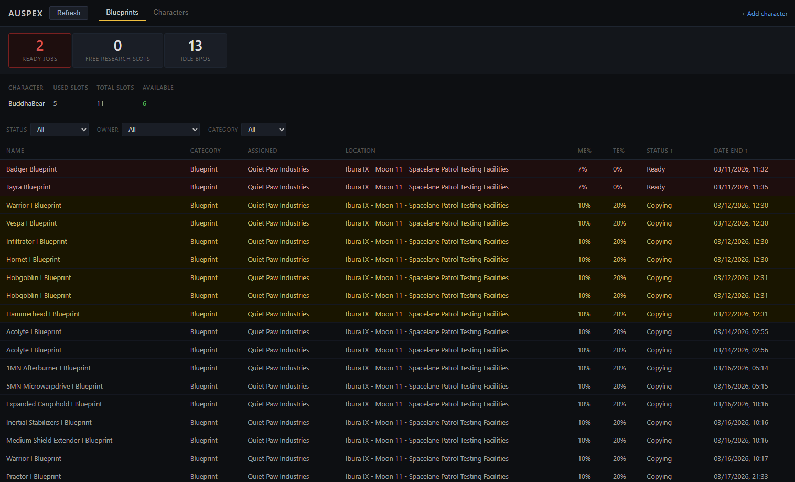

# Auspex

A local desktop tool for EVE Online industrialists who manage multiple manufacturing characters. Auspex pulls data from the EVE ESI API and presents a unified dashboard of your BPO library and research job status across all characters and corporations.



## Features

- Multi-character and corporation support via EVE SSO OAuth2
- Unified BPO table with ME%, TE%, status, owner, location, and job end date
- Row highlighting: red for overdue jobs, yellow for jobs completing today
- Summary bar: idle BPOs / overdue / completing today / free research slots
- Per-character slot usage
- Sort by any column; filter by status, owner, and category
- Auto-refresh on a configurable interval with manual force-refresh
- Single binary — no Docker, no PostgreSQL, no external services required

## Known Limitations

- Corporation management (add / remove) is not yet available in the UI — tracked in [docs/tasks-backlog.md](docs/tasks-backlog.md).
- Only the first page of ESI results is fetched — large corporation BPO libraries (>1000 items) will be truncated silently.
- Location IDs are displayed as raw numbers; human-readable station names are not yet implemented.
- Free research slots count is always 0 (requires per-character skill data from ESI, not yet implemented).

See [docs/tech-debt.md](docs/tech-debt.md) for the full list of known deferred decisions.

## Installation

Download the latest binary for your platform from the [Releases](https://github.com/dpleshakov/auspex/releases) page and unpack the archive.

No installation required — Auspex is a single self-contained binary.

## Setup

### 1. Register an EVE Developer Application

Go to [developers.eveonline.com](https://developers.eveonline.com/) and create a new application:

- **Connection Type:** Authentication & API Access
- **Callback URL:** `http://localhost:8080/auth/eve/callback`
- **Scopes:**
  - `esi-characters.read_blueprints.v1`
  - `esi-corporations.read_blueprints.v1`
  - `esi-industry.read_character_jobs.v1`
  - `esi-industry.read_corporation_jobs.v1`

Copy the **Client ID** and **Secret Key**.

### 2. Create the config file

Copy the example config included in the release archive:

```bash
cp auspex.example.yaml auspex.yaml
```

Fill in your EVE SSO credentials:

```yaml
esi:
  client_id: "your-client-id"
  client_secret: "your-client-secret"
  callback_url: "http://localhost:8080/auth/eve/callback"
```

See [docs/configuration.md](docs/configuration.md) for all available options.

### 3. Run

```bash
./auspex          # macOS / Linux
auspex.exe        # Windows
```

Open your browser and go to `http://localhost:8080`.

### 4. Add a character

Navigate to `http://localhost:8080/auth/eve/login` and complete the EVE SSO flow. Auspex immediately triggers a sync and redirects you to the dashboard. Repeat for each character.

## Files

At runtime, Auspex creates the following files next to the binary:

```
auspex(.exe)       # the binary
auspex.yaml        # your config file with credentials
auspex.db          # SQLite database, created automatically on first run
```

Backing up `auspex.db` preserves all character data. Deleting it returns Auspex to a clean state — all characters must be re-added via OAuth.

## Contributing

See [CONTRIBUTING.md](CONTRIBUTING.md) for build instructions, tooling requirements, and the development workflow.

## License

This project is not affiliated with CCP Games. EVE Online and all related marks are property of CCP hf.
